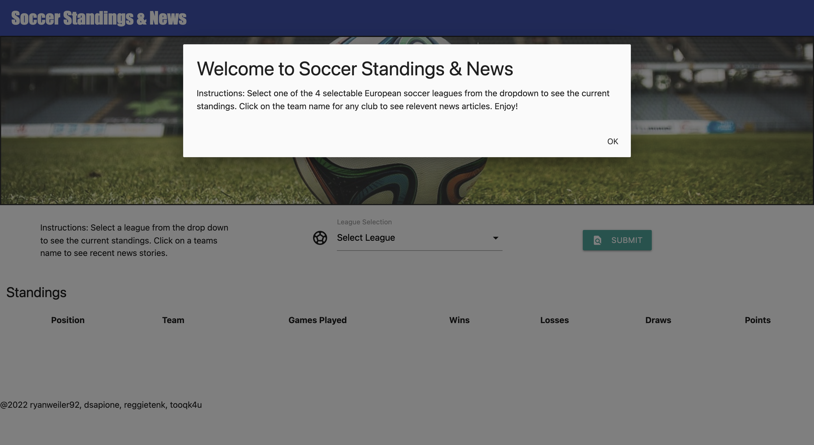

# SOCCER STANDINGS & NEWS

## Project Overview
Our website features team standings & news for the four most popular soccer leagues in Europe. When you select a league from the dropdown you are provided with the current standings from each league. Clicking on a team name will provide you with the most current news about the team. 

##  API'S USED FOR SOCCER NEWS & STANDINGS WEBSITE

<https://github.com/azharimm/football-standings-api>

<https://newsapi.org>

## Website Created With
### HTML
### CSS
### Materialize
### JavaScript

## Website
https://ryanweiler92.github.io/Soccer-Standings-News/

## Created By
### Ryan Weiler
### Daniel Sapione
### Shelley Soucie
### Reggie Tenkorang
